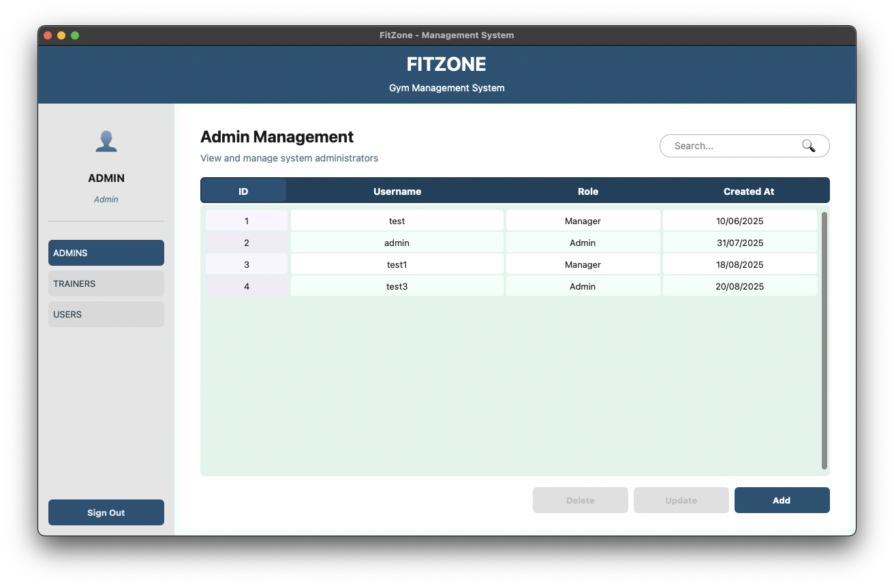

#  FitZone - Gym Management System

FitZone is a comprehensive management system designed for gyms and fitness centers. It provides tools for managing members, trainers, and administrative staff, with secure authentication and data management capabilities.


## Features

- **User Management**: Register and manage gym members with membership details and renovation dates
- **Trainer Management**: Track trainers, their specialties, and working hours
- **Admin System**: Multi-level administrative access with secure authentication
- **Data Relationships**: Connect trainers with their manager accounts
- **Secure Authentication**: Password hashing with Argon2 for maximum security
- **Fuzzy Search**: Advanced search functionality with fuzzy matching capabilities
- **Dynamic Data Tables**: Real-time CRUD operations with instant updates
- **Component-Based UI**: Modular interface with reusable components
- **Responsive Forms**: Input validation and error handling across all forms

## Interface

| View                | Description         |
|---------------------|--------------------|
|  | **Dashboard Overview** - Main navigation hub with quick access to all system modules |
|  | **Admin Management** - Comprehensive admin user table with search and CRUD operations |
|  | **Trainer Directory** - Interactive trainer management with specialties and schedule tracking |
|  | **Member Management** - Complete gym member database with membership status and details |
|  | **Admin Account Creation** - Secure administrator registration with role-based access control and password validation |
|  | **Trainer Registration** - Professional form for adding new trainers with validation |
|  | **Member Registration** - User-friendly member enrollment form with membership options |
|  | **Admin Configuration** - Secure administrative settings and user management panel |

## Installation & Setup

### Prerequisites
- Python 3.8 or higher
- pip package manager

### Quick Start

1. **Clone the repository**
   ```bash
   git clone https://github.com/vanstrouble/fitzone.git
   cd fitzone
   ```

2. **Install dependencies**
   ```bash
   pip install -r requirements.txt
   ```

3. **Run the application**
   ```bash
   python app.py
   ```

The application will launch with a login interface and automatically create the database on first run.

### Dependencies

The application requires the following packages (automatically installed via `requirements.txt`):
- **CustomTkinter**: Modern UI framework
- **SQLAlchemy**: Database ORM
- **Argon2**: Password hashing
- **PrettyTable**: Data visualization for development

## Technologies Used

### Backend
- **Python**: Core programming language
- **SQLAlchemy**: ORM for database interactions
- **SQLite**: Lightweight database engine
- **Argon2**: Modern password hashing algorithm

### Frontend
- **CustomTkinter**: Enhanced Tkinter UI library for a modern interface

### Development Tools
- **PrettyTable**: For formatted data visualization during development and testing
- **Unittest**: For testing application components

## Project Architecture

The application follows a **domain-driven design** with clean separation of concerns:

### Core Components

#### Model Layer (`/models`)
- **Inheritance hierarchy**: Base `Person` class with specialized `User`, `Trainer`, and `Admin` subclasses
- **Type safety**: Comprehensive type hints and validation throughout
- **Business logic**: Rich domain models with embedded validation rules

#### Controller Layer (`/controllers`)
- **Database abstraction**: Clean ORM layer with SQLAlchemy
- **CRUD operations**: Complete Create, Read, Update, Delete functionality
- **Data conversion**: Seamless transformation between domain and database models
- **Dashboard analytics**: Centralized business logic for reporting

#### View Layer (`/views`)
- **Component architecture**: Reusable UI components with consistent styling
- **Form validation**: Real-time input validation with user feedback
- **Dynamic tables**: Live data updates with instant CRUD operations
- **Advanced search**: Fuzzy matching for improved user experience

### Technical Highlights

- **Clean Architecture**: Domain-driven design with clear separation of concerns
- **Security First**: Argon2 password hashing with salt for maximum security
- **Real-time Updates**: Dynamic UI updates without page refreshes
- **Type Safety**: Comprehensive type hints throughout the codebase
- **Error Handling**: Graceful error boundaries across all application layers
- **Component Reusability**: Modular UI widgets with consistent interfaces

### Key Technical Features

#### Advanced Search & Data Management
- **Fuzzy matching algorithm**: Sophisticated string similarity for user-friendly search
- **Real-time filtering**: Instant search results across all data tables
- **Multi-field search**: Simultaneous search across names, emails, and other fields
- **Data integrity**: Foreign key constraints and referential integrity

#### Modern UI/UX Design
- **Component composition**: Reusable UI components with consistent styling
- **Responsive layouts**: Adaptive interface using CustomTkinter's modern styling
- **Interactive data tables**: Live CRUD operations with immediate feedback
- **Color theming**: Centralized color management for brand consistency

#### Robust Form System
- **Dynamic validation**: Real-time input validation with user-friendly feedback
- **Input sanitization**: Comprehensive data cleaning before database operations
- **State management**: Proper handling of create/edit modes with data pre-population

#### Enterprise-Grade Security
- **Password hashing**: Industry-standard Argon2 algorithm with salt
- **Session management**: Secure authentication with proper lifecycle management
- **Role-based access**: Multi-level access control for different user types
- **Input validation**: Protection against injection attacks
